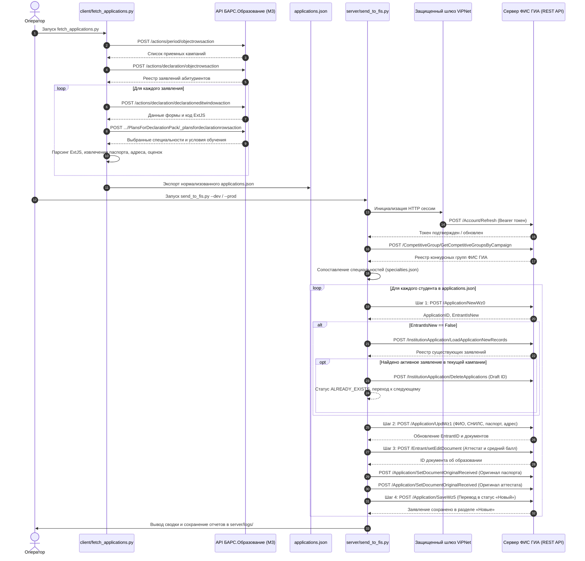
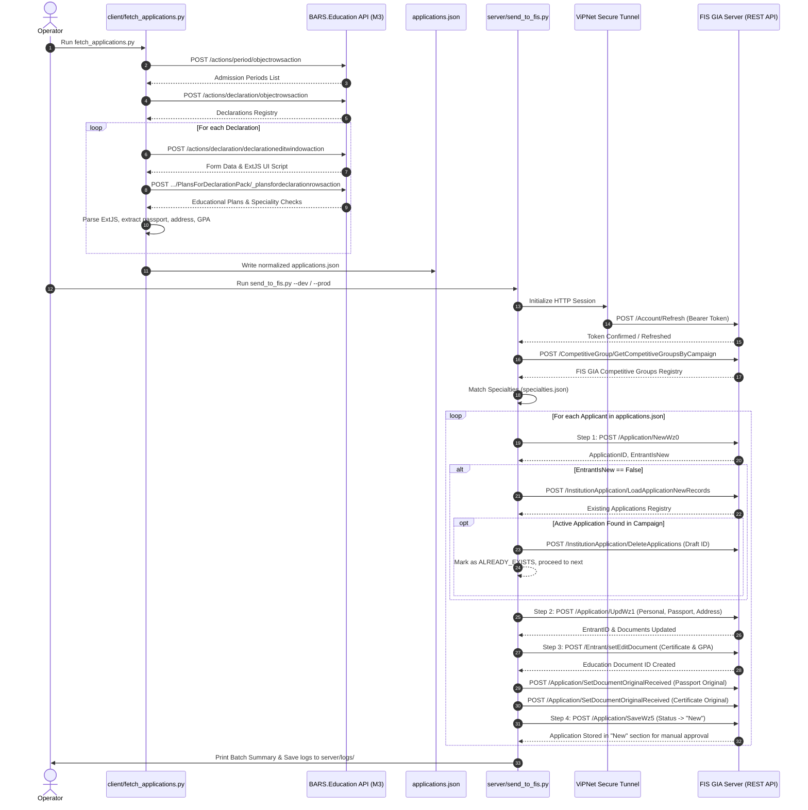

# Техническая спецификация интеграции БАРС.Образование ↔ ФИС ГИА и Приема
# Technical Integration Specification: BARS.Education ↔ FIS GIA

[]()
[]()

---

## 🇷🇺 RU: Содержание (Русская версия)

- [1. Архитектура системы и сквозная диаграмма последовательности](#1-архитектура-системы-и-сквозная-диаграмма-последовательности)
- [2. Клиентский протокол: БАРС.Образование (M3 Platform API)](#2-клиентский-протокол-барсобразование-m3-platform-api)
  - [2.1 Аутентификация и заголовки сессии](#21-аутентификация-и-заголовки-сессии)
  - [2.2 Получение приемных кампаний (`/actions/period/objectrowsaction`)](#22-получение-приемных-кампаний-actionsperiodobjectrowsaction)
  - [2.3 Получение реестра заявлений (`/actions/declaration/objectrowsaction`)](#23-получение-реестра-заявлений-actionsdeclarationobjectrowsaction)
  - [2.4 Окно редактирования заявления и парсинг ExtJS](#24-окно-редактирования-заявления-и-парсинг-extjs)
  - [2.5 Запрос персональных данных абитуриента (`EnrolleePack`)](#25-запрос-персональных-данных-абитуриента-enrolleepack)
  - [2.6 Получение выбранных специальностей и условий обучения](#26-получение-выбранных-специальностей-и-условий-обучения)
  - [2.7 Спецификация формата `applications.json`](#27-спецификация-формата-applicationsjson)
- [3. Серверный протокол: ФИС ГИА и Приема (REST & WZ RPC)](#3-серверный-протокол-фис-гиа-и-приема-rest--wz-rpc)
  - [3.1 Топология сети и шлюз ViPNet](#31-топология-сети-и-шлюз-vipnet)
  - [3.2 Авторизация и обновление токена (`/Account/Refresh`)](#32-авторизация-и-обновление-токена-accountrefresh)
  - [3.3 Динамическое обнаружение кампаний и конкурсных групп](#33-динамическое-обнаружение-кампаний-и-конкурсных-групп)
  - [3.4 Алгоритм сопоставления специальностей (`specialties.json`)](#34-алгоритм-сопоставления-специальностей-specialtiesjson)
  - [3.5 Пошаговый пайплайн создания заявления](#35-пошаговый-пайплайн-создания-заявления)
    - [Шаг 1: Инициализация черновика (`POST /Application/NewWz0`)](#шаг-1-инициализация-черновика-post-applicationnewwz0)
    - [Шаг 1.1: Проверка существующих заявлений и удаление дубликатов](#шаг-11-проверка-существующих-заявлений-и-удаление-дубликатов)
    - [Шаг 1.5: Определение EntrantID (`/Application/Wz1`)](#шаг-15-определение-entrantid-applicationwz1)
    - [Шаг 2: Личные и паспортные данные (`POST /Application/UpdWz1`)](#шаг-2-личные-и-паспортные-данные-post-applicationupdwz1)
    - [Шаг 3: Прикрепление документа об образовании (`POST /Entrant/setEditDocument`)](#шаг-3-прикрепление-документа-об-образовании-post-entrantseteditdocument)
    - [Шаг 3.5: Подтверждение предоставления оригиналов (`POST /Application/SetDocumentOriginalReceived`)](#шаг-35-подтверждение-предоставления-оригиналов-post-applicationsetdocumentoriginalreceived)
    - [Шаг 4: Перевод заявления в статус «Новый» (`POST /Application/SaveWz5`)](#шаг-4-перевод-заявления-в-статус-новый-post-applicationsavewz5)
- [4. Пакетная обработка, разрешение коллизий и коды статусов](#4-пакетная-обработка-разрешение-коллизий-и-коды-статусов)

---

## 🌐 EN: Table of Contents (English Version)

- [1. System Architecture & End-to-End Sequence](#1-system-architecture--end-to-end-sequence)
- [2. Client Protocol: BARS.Education (M3 Platform API)](#2-client-protocol-barseducation-m3-platform-api)
  - [2.1 Authentication & Session Headers](#21-authentication--session-headers)
  - [2.2 Admission Periods Discovery (`/actions/period/objectrowsaction`)](#22-admission-periods-discovery-actionsperiodobjectrowsaction)
  - [2.3 Declarations List (`/actions/declaration/objectrowsaction`)](#23-declarations-list-actionsdeclarationobjectrowsaction)
  - [2.4 Declaration Edit Window & ExtJS Parsing](#24-declaration-edit-window--extjs-parsing)
  - [2.5 Enrollee Personal Details Fallback](#25-enrollee-personal-details-fallback)
  - [2.6 Selected Specialties & Study Plans](#26-selected-specialties--study-plans)
  - [2.7 `applications.json` Schema Specification](#27-applicationsjson-schema-specification)
- [3. Server Protocol: FIS GIA (REST & Wizard RPC)](#3-server-protocol-fis-gia-rest--wizard-rpc)
  - [3.1 Network Topology & ViPNet Gateway](#31-network-topology--vipnet-gateway)
  - [3.2 Authentication & Token Refresh (`/Account/Refresh`)](#32-authentication--token-refresh-accountrefresh)
  - [3.3 Dynamic Discovery (Campaigns & Groups)](#33-dynamic-discovery-campaigns--groups)
  - [3.4 Specialty Fuzzy Matching Engine (`specialties.json`)](#34-specialty-fuzzy-matching-engine-specialtiesjson)
  - [3.5 Multi-Step Submission Pipeline](#35-multi-step-submission-pipeline)
    - [Step 1: Draft Initialization (`POST /Application/NewWz0`)](#step-1-draft-initialization-post-applicationnewwz0)
    - [Step 1.1: Duplicate Check & Draft Cleanup](#step-11-duplicate-check--draft-cleanup)
    - [Step 1.5: Entrant ID Resolution (`/Application/Wz1`)](#step-15-entrant-id-resolution-applicationwz1)
    - [Step 2: Personal & Identity Data (`POST /Application/UpdWz1`)](#step-2-personal--identity-data-post-applicationupdwz1)
    - [Step 3: Education Certificate Attachment (`POST /Entrant/setEditDocument`)](#step-3-education-certificate-attachment-post-entrantseteditdocument)
    - [Step 3.5: Original Documents Confirmation (`POST /Application/SetDocumentOriginalReceived`)](#step-35-original-documents-confirmation-post-applicationsetdocumentoriginalreceived)
    - [Step 4: Status Transition to "New" (`POST /Application/SaveWz5`)](#step-4-status-transition-to-new-post-applicationsavewz5)
- [4. Batch Processing, Collision Resolution & Status Codes](#4-batch-processing-collision-resolution--status-codes)

---

# 🇷🇺 RU: Техническая спецификация (Русская версия)

## 1. Архитектура системы и сквозная диаграмма последовательности



---

## 2. Клиентский протокол: БАРС.Образование (M3 Platform API)

Клиент взаимодействует с веб-платформой БАРС (M3 Framework) посредством HTTP POST запросов в формате `application/x-www-form-urlencoded` и обрабатывает смешанные ответы (JSON и JavaScript ExtJS).

### 2.1 Аутентификация и заголовки сессии

Каждый запрос к платформе БАРС требует передачи следующих заголовков и файлов cookie:

```http
POST /actions/{pack_path}/{action_name} HTTP/1.1
Host: xn--n1abf.xn--33-6kcadhwnl3cfdx.xn--p1ai
User-Agent: Mozilla/5.0 (Windows NT 10.0; Win64; x64) AppleWebKit/537.36 (KHTML, like Gecko) Chrome/109.0.0.0 Safari/537.36
Accept: application/json, text/javascript, */*; q=0.01
X-Requested-With: XMLHttpRequest
X-CSRFToken: <CSRFTOKEN_ИЗ_COOKIE>
Cookie: userNotifiedAboutCookieUsage=t; csrf_token_header_name=X-CSRFToken; ssuz_sessionid=<SSUZ_SESSIONID_ИЗ_COOKIE>; csrftoken=<CSRFTOKEN_ИЗ_COOKIE>
Content-Type: application/x-www-form-urlencoded; charset=UTF-8
```

---

### 2.2 Получение приемных кампаний (`/actions/period/objectrowsaction`)

Запрашивает перечень доступных приемных периодов в системе БАРС.

- **URL**: `POST {BARS_BASE_URL}/actions/period/objectrowsaction`
- **Тело запроса**:
  ```ini
  start=0
  limit=50
  period_id=
  m3_window_id=cmp_266a9153
  filter=
  ```
- **Структура ответа**:
  ```json
  {
    "rows": [
      {
        "id": 41,
        "name": "Приемная кампания 2026",
        "__str__": "Приемная кампания 2026"
      }
    ],
    "total": 1
  }
  ```

---

### 2.3 Получение реестра заявлений (`/actions/declaration/objectrowsaction`)

Запрашивает список заявлений абитуриентов с учетом фильтрации по периоду, поисковой строке, диапазону дат и сортировке.

- **URL**: `POST {BARS_BASE_URL}/actions/declaration/objectrowsaction`
- **Тело запроса**:
  ```ini
  period_id=41
  limit=25
  start=0
  m3_window_id=cmp_266a9153
  grid_id=cmp_17688a62
  sort=date
  dir=DESC
  filter=                 # Текстовый поиск по ФИО (опционально)
  filter_1=2026-07-01T00:00:00 # Начало периода в ISO формате (опционально)
  filter_2=2026-08-15T00:00:00 # Конец периода в ISO формате (опционально)
  ```
- **Особенности**: Заявления со статусом `"отклонено"` автоматически игнорируются.

---

### 2.4 Окно редактирования заявления и парсинг ExtJS

Запрашивает полное окно редактирования заявления, содержащее поля личных данных в виде ExtJS компонентов.

- **URL**: `POST {BARS_BASE_URL}/actions/declaration/declarationeditwindowaction`
- **Тело запроса**:
  ```ini
  object_id=12345
  id=12345
  declaration_id=12345
  ```
- **Фрагмент ответа**:
  ```javascript
  new Ext.form.TextField({
      name: 'last_name',
      value: 'Иванов'
  });
  new Ext.form.TextField({
      name: 'passport_series',
      value: '1718'
  });
  ```
- **Алгоритм парсинга (`client/parsers.py`)**:
  ```python
  pattern = re.compile(
      r"name\s*:\s*['\"](?P<name>[^'\"]+)['\"]"
      r"(?:(?!new Ext\.).)*?"
      r"(?:value\s*:\s*(?P<val_str>'[^']*'|\"[^\"]*\"|\d+(?:\.\d+)?|true|false)|defaultText\s*:\s*['\"](?P<def_text>[^'\"]+)['\"])",
      re.DOTALL
  )
  ```

---

### 2.5 Запрос персональных данных абитуриента (`EnrolleePack`)

Если паспортные данные отсутствуют в форме заявления, выполняется резервный опрос пакетов абитуриента:
- `ssuz.enrollee.ui.actions.EnrolleePack / objecteditwindowaction`
- `ssuz.enrollee.ui.actions.EnrolleePack / editwindowaction`
- `enrollee / objecteditwindowaction`

---

### 2.6 Получение выбранных специальностей и условий обучения

- **URL**: `POST {BARS_BASE_URL}/actions/ssuz.declaration.actions.PlansForDeclarationPack/_plansfordeclarationrowsaction`
- **Тело запроса**:
  ```ini
  limit=50
  start=0
  declaration_id=12345
  period_id=41
  unit_id=26
  finished_forms=1
  m3_window_id=cmp_...
  grid_id=cmp_...
  ```
- **Извлекаемые поля**:
  ```json
  [
    {
      "speciality_name": "Сестринское дело",
      "speciality_program_type_name": "Программа подготовки специалистов среднего звена",
      "regional_budget_study_type_check": true
    }
  ]
  ```

---

### 2.7 Спецификация формата `applications.json`

```json
[
  {
    "application_number": "",
    "bars_declaration_id": 12345,
    "portal_app_id": "EPGU-987654",
    "user_epgu_id": "1000234567",
    "last_name": "Иванов",
    "first_name": "Иван",
    "middle_name": "Иванович",
    "snils": "123-456-789 00",
    "passport_series": "1718",
    "passport_number": "123456",
    "passport_organization": "Отделом УФМС России...",
    "passport_issuer_code": "330-001",
    "gender": "Мужской",
    "date_of_birth": "15.05.2008",
    "reg_address_full": "Владимирская обл., г. Ковров, ул. Ленина, д. 1",
    "selected_specialties": [
      {
        "speciality_name": "Сестринское дело",
        "speciality_program_type_name": "Программа подготовки специалистов среднего звена",
        "regional_budget_study_type_check": true
      }
    ],
    "diploma_series": "",
    "diploma_number": "0332400012345",
    "diploma_date": "25.06.2024",
    "diploma_organization": "МБОУ СОШ №1 г. Коврова",
    "average_mark": "4.55"
  }
]
```

---

## 3. Серверный протокол: ФИС ГИА и Приема (REST & WZ RPC)

### 3.1 Топология сети и шлюз ViPNet

Взаимодействие с ФИС ГИА возможно исключительно внутри защищенного контура **ViPNet Client**.

| Контур | Базовый URL | Назначение |
| :--- | :--- | :--- |
| **Тестовый (Dev)** | `http://10.0.3.1:8383` | Песочница для отладки структуры запросов |
| **Боевой (Prod)** | `http://10.0.3.1:8080` | Официальная база данных приема |

Стандартные заголовки сессии:
```http
POST /Application/{endpoint} HTTP/1.1
Host: 10.0.3.1:8383
Content-Type: application/json; charset=UTF-8
Accept: application/json, text/javascript, */*
Authorization: Bearer <ACCESS_TOKEN>
Cookie: gvuz.cookie=n; fisTokenIsValid=True; fisAccess=<ACCESS_TOKEN>
X-Requested-With: XMLHttpRequest
Origin: http://10.0.3.1:8383
Referer: http://10.0.3.1:8383/Application/
```

---

### 3.2 Авторизация и обновление токена (`/Account/Refresh`)

- **Опрашиваемые эндпоинты**:
  1. `POST {FIS_BASE_URL}/Account/Refresh`
  2. `POST {FIS_BASE_URL}/Account/RefreshToken`
  3. `POST {FIS_BASE_URL}/api/account/refresh`
- **Тело запроса**:
  ```json
  {
    "accessToken": "eyJhbGciOi...",
    "refreshToken": "d8a7c2..."
  }
  ```

---

### 3.3 Динамическое обнаружение кампаний и конкурсных групп

1. **Запрос ID организации**:
   - `POST /Application/GetCampaignById`
   - Тело: `{"campaignId": "12345"}` $\rightarrow$ возвращает `Data.InstitutionID`.
2. **Запрос конкурсных групп**:
   - `POST /CompetitiveGroup/GetCompetitiveGroupsByCampaign`
   - Тело:
     ```json
     {
       "CampaignID": 12345,
       "EducationLevelID": "17",
       "InstitutionID": 6789
     }
     ```
   - Возвращает массив зарегистрированных конкурсов (`[{"ID": 4501, "Name": "СД-126"}]`).

---

### 3.4 Алгоритм сопоставления специальностей (`specialties.json`)

1. Ключевые слова из `specialties.json` проверяются на вхождение в строку `speciality_name` в нижнем регистре.
2. Извлекаются целевые префиксы (например, `["МР-126", "МР-226", "МР"]`).
3. Конкурсные группы сопоставляются по точному префиксу либо по базовой буквенной основе (`^[A-ZА-яЁё]+`).
4. Результаты сортируются по числовому суффиксу (`extract_numeric_suffix`) и приоритету.

---

### 3.5 Пошаговый пайплайн создания заявления

#### Шаг 1: Инициализация черновика (`POST /Application/NewWz0`)

- **URL**: `POST {FIS_BASE_URL}/Application/NewWz0`
- **Тело запроса**:
  ```json
  {
    "ApplicationId": 0,
    "InstitutionID": 6789,
    "CampaignID": "12345",
    "DocumentSeries": "1718",
    "DocumentNumber": "123456",
    "FromEPGU": true,
    "IdentityDocumentTypeID": "1",
    "RegistrationDate": "05.08.2026",
    "ApplicationNumber": "1-26",
    "Priorities": {
      "ApplicationId": -1,
      "ApplicationPriorities": [
        {
          "CompetitiveGroupId": "4501",
          "EducationFormId": "11",
          "EducationSourceId": "14",
          "IsForSPOandVO": false
        }
      ]
    },
    "SelectedCompetitiveGroupIDs": [],
    "SelectedDirectionIDs": [],
    "SelectedParentDirectionIDs": null,
    "SelectedTargetOrganizationIDO": 0,
    "SelectedTargetOrganizationIDOZ": 0,
    "SelectedTargetOrganizationIDZ": 0,
    "CheckForExistingBeforeCreate": true,
    "CheckUniqueBeforeCreate": true,
    "CheckZerozBeforeCreate": true,
    "After11": false
  }
  ```

---

#### Шаг 1.1: Проверка существующих заявлений и удаление дубликатов

Если `Data.EntrantIsNew == false`:
- **Поиск**: `POST {FIS_BASE_URL}/InstitutionApplication/LoadApplicationNewRecords` (по серии и номеру паспорта).
- **Удаление черновика**: Если заявление уже существует в кампании, созданный черновик удаляется:
  - `POST {FIS_BASE_URL}/InstitutionApplication/DeleteApplications`
  - Тело: `{"applicationId": [int(app_id)]}`
  - Присваивается статус: `ALREADY_EXISTS`.

---

#### Шаг 1.5: Определение EntrantID (`/Application/Wz1`)

Если `EntrantID` не вернулся в ответе шага 1, он извлекается со страницы формы:
- `GET {FIS_BASE_URL}/Application/Wz1?id={app_id}`

---

#### Шаг 2: Личные и паспортные данные (`POST /Application/UpdWz1`)

- **URL**: `POST {FIS_BASE_URL}/Application/UpdWz1`
- **Тело запроса**:
  ```json
  {
    "ApplicationID": 98765,
    "InstitutionID": 6789,
    "EntrantID": "54321",
    "LastName": "Иванов",
    "FirstName": "Иван",
    "MiddleName": "Иванович",
    "SNILS": "123-456-789 00",
    "GenderID": "1",
    "BirthDate": "15.05.2008",
    "DocumentTypeID": "1",
    "DocumentSeries": "1718",
    "DocumentNumber": "123456",
    "DocumentOrganization": "Отделом УФМС...",
    "DocumentDate": "01.01.2020",
    "SubdivisionCode": "330-001",
    "NationalityID": "1",
    "BirthPlace": "",
    "CustomInformation": "",
    "ReleaseCountryID": "1",
    "ReleasePlace": "Россия",
    "SelectedCitizenships": null,
    "NoSnilsReason": "0",
    "Email": "",
    "RegionID": "33",
    "TownTypeID": "2",
    "Address": "Владимирская обл., г. Ковров...",
    "IsFromKrym": false,
    "IsFromKrymEntrantDocumentID": "",
    "FromEPGU": true,
    "IsFromEPGU": true,
    "OriginalReceived": true,
    "OriginalReceivedDate": "05.08.2026",
    "IsOriginal": true,
    "IsCopy": false,
    "WizardStepID": 2
  }
  ```

---

#### Шаг 3: Прикрепление документа об образовании (`POST /Entrant/setEditDocument`)

- **URL**: `POST {FIS_BASE_URL}/Entrant/setEditDocument`
- **Тело запроса**:
  ```json
  {
    "EntrantID": 54321,
    "EntrantDocumentID": 0,
    "DocumentTypeID": 16,
    "DocumentTypeName": "",
    "UID": "",
    "ApplicationID": 98765,
    "DocumentSeries": "",
    "DocumentNumber": "0332400012345",
    "DocumentDate": "25.06.2024",
    "DocumentOrganization": "МБОУ СОШ №1 г. Коврова",
    "OriginalReceived": true,
    "OriginalReceivedDate": "05.08.2026",
    "EntDocEdu": {
      "GPA": "4,5500",
      "RegionId": "33",
      "StateServicePreparation": false,
      "IsNostrificated": false
    },
    "EntDocSubBall": {
      "SubjectBalls": []
    }
  }
  ```

---

#### Шаг 3.5: Подтверждение предоставления оригиналов (`POST /Application/SetDocumentOriginalReceived`)

- **URL**: `POST {FIS_BASE_URL}/Application/SetDocumentOriginalReceived`
- **Content-Type**: `application/x-www-form-urlencoded; charset=UTF-8`
- **Запрос 1 (Паспорт)**:
  `applicationID=98765&entrantDocumentID={passport_doc_id}&received=true&receivedDate=05.08.2026`
- **Запрос 2 (Аттестат)**:
  `applicationID=98765&entrantDocumentID={edu_doc_id}&received=true&receivedDate=05.08.2026`

---

#### Шаг 4: Перевод заявления в статус «Новый» (`POST /Application/SaveWz5`)

Переводит заявление из временного состояния редактирования в штатный статус черновика («Новый»), делая его доступным для проверки и проведения оператором.

- **URL**: `POST {FIS_BASE_URL}/Application/SaveWz5`
- **Тело запроса**:
  ```json
  {
    "model": {
      "Step": 4,
      "ApplicationID": 98765,
      "EntrantID": 54321,
      "RegistrationDate": "05.08.2026",
      "ApplicationNumber": "1-26",
      "NeedHostel": false,
      "changePage": false,
      "FromEPGU": true,
      "IsFromEPGU": true,
      "ApplicationPriorities": {
        "ApplicationId": 98765,
        "ApplicationPriorities": [
          {
            "CompetitiveGroupId": "4501",
            "EducationFormId": "11",
            "EducationSourceId": "14",
            "IsForSPOandVO": false,
            "ApplicationId": 98765,
            "IsAgreed": false,
            "IsDisagreed": false,
            "IsDisagreedDate": "",
            "CalculatedRating": ""
          }
        ],
        "ChangeCg": false
      },
      "After11": false
    }
  }
  ```

---

## 4. Пакетная обработка, разрешение коллизий и коды статусов

| Код статуса | Описание | Действие со счетчиком номеров |
| :--- | :--- | :--- |
| `CREATED` | Заявление успешно создано через все шаги мастера. | Инкремент счетчика (`ID_START += 1`) |
| `PARTIAL_SUCCESS` | Создано, но часть второстепенных специальностей не сопоставлена. | Инкремент счетчика (`ID_START += 1`) |
| `ALREADY_EXISTS` | Абитуриент уже имеет заявление; временный черновик удален. | **Счетчик сохраняется** для следующего студента |
| `ERROR_APP_NUMBER_EXISTS` | Номер заявления занят на сервере. Автоинкремент и повтор до 5 раз. | Инкремент и повтор; прерывание при стартовой коллизии |
| `ERROR_UNMATCHED_SPECIALTY` | Ни одна из специальностей не сопоставлена со справочником. | **Счетчик сохраняется** для следующего студента |
| `ERROR_DISCOVERY_FAILED` | Ошибка загрузки кампании или конкурсных групп с сервера. | Прерывание пакета |
| `ERROR` | Непредвиденная сетевая или HTTP ошибка. | Фиксация в `response_*.json` |

---

<br><br>

---

# 🌐 EN: Technical Specification (English Version)

## 1. System Architecture & End-to-End Sequence



---

## 2. Client Protocol: BARS.Education (M3 Platform API)

The client communicates with the BARS M3 Web Framework via `application/x-www-form-urlencoded` HTTP POST requests and processes mixed JSON and JavaScript ExtJS responses.

### 2.1 Authentication & Session Headers

```http
POST /actions/{pack_path}/{action_name} HTTP/1.1
Host: xn--n1abf.xn--33-6kcadhwnl3cfdx.xn--p1ai
User-Agent: Mozilla/5.0 (Windows NT 10.0; Win64; x64) AppleWebKit/537.36 (KHTML, like Gecko) Chrome/109.0.0.0 Safari/537.36
Accept: application/json, text/javascript, */*; q=0.01
X-Requested-With: XMLHttpRequest
X-CSRFToken: <CSRFTOKEN_COOKIE_VALUE>
Cookie: userNotifiedAboutCookieUsage=t; csrf_token_header_name=X-CSRFToken; ssuz_sessionid=<SSUZ_SESSIONID_COOKIE_VALUE>; csrftoken=<CSRFTOKEN_COOKIE_VALUE>
Content-Type: application/x-www-form-urlencoded; charset=UTF-8
```

---

### 2.2 Admission Periods Discovery (`/actions/period/objectrowsaction`)

- **URL**: `POST {BARS_BASE_URL}/actions/period/objectrowsaction`
- **Request Payload**:
  ```ini
  start=0
  limit=50
  period_id=
  m3_window_id=cmp_266a9153
  filter=
  ```
- **Response Format**:
  ```json
  {
    "rows": [
      {
        "id": 41,
        "name": "Приемная кампания 2026",
        "__str__": "Приемная кампания 2026"
      }
    ],
    "total": 1
  }
  ```

---

### 2.3 Declarations List (`/actions/declaration/objectrowsaction`)

- **URL**: `POST {BARS_BASE_URL}/actions/declaration/objectrowsaction`
- **Request Payload**:
  ```ini
  period_id=41
  limit=25
  start=0
  m3_window_id=cmp_266a9153
  grid_id=cmp_17688a62
  sort=date
  dir=DESC
  filter=                 # Text search by name (optional)
  filter_1=2026-07-01T00:00:00 # Range start in ISO format (optional)
  filter_2=2026-08-15T00:00:00 # Range end in ISO format (optional)
  ```
- **Behavior**: Declarations with status `"отклонено"` (rejected) are skipped automatically.

---

### 2.4 Declaration Edit Window & ExtJS Parsing

- **URL**: `POST {BARS_BASE_URL}/actions/declaration/declarationeditwindowaction`
- **Request Payload**:
  ```ini
  object_id=12345
  id=12345
  declaration_id=12345
  ```
- **Response Code Snippet**:
  ```javascript
  new Ext.form.TextField({
      name: 'last_name',
      value: 'Иванов'
  });
  new Ext.form.TextField({
      name: 'passport_series',
      value: '1718'
  });
  ```
- **Parsing Implementation (`client/parsers.py`)**:
  ```python
  pattern = re.compile(
      r"name\s*:\s*['\"](?P<name>[^'\"]+)['\"]"
      r"(?:(?!new Ext\.).)*?"
      r"(?:value\s*:\s*(?P<val_str>'[^']*'|\"[^\"]*\"|\d+(?:\.\d+)?|true|false)|defaultText\s*:\s*['\"](?P<def_text>[^'\"]+)['\"])",
      re.DOTALL
  )
  ```

---

### 2.5 Enrollee Personal Details Fallback

If passport fields are omitted in the declaration edit window, fallback queries are dispatched to:
- `ssuz.enrollee.ui.actions.EnrolleePack / objecteditwindowaction`
- `ssuz.enrollee.ui.actions.EnrolleePack / editwindowaction`
- `enrollee / objecteditwindowaction`

---

### 2.6 Selected Specialties & Study Plans

- **URL**: `POST {BARS_BASE_URL}/actions/ssuz.declaration.actions.PlansForDeclarationPack/_plansfordeclarationrowsaction`
- **Request Payload**:
  ```ini
  limit=50
  start=0
  declaration_id=12345
  period_id=41
  unit_id=26
  finished_forms=1
  m3_window_id=cmp_...
  grid_id=cmp_...
  ```
- **Parsed Data**:
  ```json
  [
    {
      "speciality_name": "Сестринское дело",
      "speciality_program_type_name": "Программа подготовки специалистов среднего звена",
      "regional_budget_study_type_check": true
    }
  ]
  ```

---

### 2.7 `applications.json` Schema Specification

```json
[
  {
    "application_number": "",
    "bars_declaration_id": 12345,
    "portal_app_id": "EPGU-987654",
    "user_epgu_id": "1000234567",
    "last_name": "Иванов",
    "first_name": "Иван",
    "middle_name": "Иванович",
    "snils": "123-456-789 00",
    "passport_series": "1718",
    "passport_number": "123456",
    "passport_organization": "Отделом УФМС России...",
    "passport_issuer_code": "330-001",
    "gender": "Мужской",
    "date_of_birth": "15.05.2008",
    "reg_address_full": "Владимирская обл., г. Ковров, ул. Ленина, д. 1",
    "selected_specialties": [
      {
        "speciality_name": "Сестринское дело",
        "speciality_program_type_name": "Программа подготовки специалистов среднего звена",
        "regional_budget_study_type_check": true
      }
    ],
    "diploma_series": "",
    "diploma_number": "0332400012345",
    "diploma_date": "25.06.2024",
    "diploma_organization": "МБОУ СОШ №1 г. Коврова",
    "average_mark": "4.55"
  }
]
```

---

## 3. Server Protocol: FIS GIA (REST & Wizard RPC)

### 3.1 Network Topology & ViPNet Gateway

Access to FIS GIA endpoints requires routing through the **ViPNet Client** virtual private network.

| Environment | Base URL | Purpose |
| :--- | :--- | :--- |
| **Development / Test** | `http://10.0.3.1:8383` | Sandbox test contour for payload verification |
| **Production** | `http://10.0.3.1:8080` | Official federal admission database |

Standard Request Headers:
```http
POST /Application/{endpoint} HTTP/1.1
Host: 10.0.3.1:8383
Content-Type: application/json; charset=UTF-8
Accept: application/json, text/javascript, */*
Authorization: Bearer <ACCESS_TOKEN>
Cookie: gvuz.cookie=n; fisTokenIsValid=True; fisAccess=<ACCESS_TOKEN>
X-Requested-With: XMLHttpRequest
Origin: http://10.0.3.1:8383
Referer: http://10.0.3.1:8383/Application/
```

---

### 3.2 Authentication & Token Refresh (`/Account/Refresh`)

- **Endpoints**:
  1. `POST {FIS_BASE_URL}/Account/Refresh`
  2. `POST {FIS_BASE_URL}/Account/RefreshToken`
  3. `POST {FIS_BASE_URL}/api/account/refresh`
- **Payload**:
  ```json
  {
    "accessToken": "eyJhbGciOi...",
    "refreshToken": "d8a7c2..."
  }
  ```

---

### 3.3 Dynamic Discovery (Campaigns & Groups)

1. **Institution ID Discovery**:
   - `POST /Application/GetCampaignById`
   - Payload: `{"campaignId": "12345"}` $\rightarrow$ returns `Data.InstitutionID`.
2. **Competitive Groups Discovery**:
   - `POST /CompetitiveGroup/GetCompetitiveGroupsByCampaign`
   - Payload:
     ```json
     {
       "CampaignID": 12345,
       "EducationLevelID": "17",
       "InstitutionID": 6789
     }
     ```
   - Returns available groups (e.g. `[{"ID": 4501, "Name": "СД-126"}]`).

---

### 3.4 Specialty Fuzzy Matching Engine (`specialties.json`)

1. Program names from applications are matched against keyword definitions in `specialties.json`.
2. Target prefixes are resolved.
3. Groups in `dynamic_cg_map` are matched by prefix or stem (`^[A-ZА-яЁё]+`).
4. Matched groups are ordered by numerical suffix and priority.

---

### 3.5 Multi-Step Submission Pipeline

#### Step 1: Draft Initialization (`POST /Application/NewWz0`)

- **URL**: `POST {FIS_BASE_URL}/Application/NewWz0`
- **Request Payload**:
  ```json
  {
    "ApplicationId": 0,
    "InstitutionID": 6789,
    "CampaignID": "12345",
    "DocumentSeries": "1718",
    "DocumentNumber": "123456",
    "FromEPGU": true,
    "IdentityDocumentTypeID": "1",
    "RegistrationDate": "05.08.2026",
    "ApplicationNumber": "1-26",
    "Priorities": {
      "ApplicationId": -1,
      "ApplicationPriorities": [
        {
          "CompetitiveGroupId": "4501",
          "EducationFormId": "11",
          "EducationSourceId": "14",
          "IsForSPOandVO": false
        }
      ]
    },
    "SelectedCompetitiveGroupIDs": [],
    "SelectedDirectionIDs": [],
    "SelectedParentDirectionIDs": null,
    "SelectedTargetOrganizationIDO": 0,
    "SelectedTargetOrganizationIDOZ": 0,
    "SelectedTargetOrganizationIDZ": 0,
    "CheckForExistingBeforeCreate": true,
    "CheckUniqueBeforeCreate": true,
    "CheckZerozBeforeCreate": true,
    "After11": false
  }
  ```

---

#### Step 1.1: Duplicate Check & Draft Cleanup

If `Data.EntrantIsNew == false`:
- **Query**: `POST {FIS_BASE_URL}/InstitutionApplication/LoadApplicationNewRecords`
- **Cleanup**: If an active application exists for this passport in the campaign, the newly initialized draft is deleted immediately:
  - `POST {FIS_BASE_URL}/InstitutionApplication/DeleteApplications`
  - Payload: `{"applicationId": [int(app_id)]}`
  - Status assigned: `ALREADY_EXISTS`.

---

#### Step 1.5: Entrant ID Resolution (`/Application/Wz1`)

If `EntrantID` is not returned in Step 1, it is scraped from the form endpoint:
- `GET {FIS_BASE_URL}/Application/Wz1?id={app_id}`

---

#### Step 2: Personal & Identity Data (`POST /Application/UpdWz1`)

- **URL**: `POST {FIS_BASE_URL}/Application/UpdWz1`
- **Request Payload**:
  ```json
  {
    "ApplicationID": 98765,
    "InstitutionID": 6789,
    "EntrantID": "54321",
    "LastName": "Иванов",
    "FirstName": "Иван",
    "MiddleName": "Иванович",
    "SNILS": "123-456-789 00",
    "GenderID": "1",
    "BirthDate": "15.05.2008",
    "DocumentTypeID": "1",
    "DocumentSeries": "1718",
    "DocumentNumber": "123456",
    "DocumentOrganization": "Отделом УФМС...",
    "DocumentDate": "01.01.2020",
    "SubdivisionCode": "330-001",
    "NationalityID": "1",
    "BirthPlace": "",
    "CustomInformation": "",
    "ReleaseCountryID": "1",
    "ReleasePlace": "Россия",
    "SelectedCitizenships": null,
    "NoSnilsReason": "0",
    "Email": "",
    "RegionID": "33",
    "TownTypeID": "2",
    "Address": "Владимирская обл., г. Ковров...",
    "IsFromKrym": false,
    "IsFromKrymEntrantDocumentID": "",
    "FromEPGU": true,
    "IsFromEPGU": true,
    "OriginalReceived": true,
    "OriginalReceivedDate": "05.08.2026",
    "IsOriginal": true,
    "IsCopy": false,
    "WizardStepID": 2
  }
  ```

---

#### Step 3: Education Certificate Attachment (`POST /Entrant/setEditDocument`)

- **URL**: `POST {FIS_BASE_URL}/Entrant/setEditDocument`
- **Request Payload**:
  ```json
  {
    "EntrantID": 54321,
    "EntrantDocumentID": 0,
    "DocumentTypeID": 16,
    "DocumentTypeName": "",
    "UID": "",
    "ApplicationID": 98765,
    "DocumentSeries": "",
    "DocumentNumber": "0332400012345",
    "DocumentDate": "25.06.2024",
    "DocumentOrganization": "МБОУ СОШ №1 г. Коврова",
    "OriginalReceived": true,
    "OriginalReceivedDate": "05.08.2026",
    "EntDocEdu": {
      "GPA": "4,5500",
      "RegionId": "33",
      "StateServicePreparation": false,
      "IsNostrificated": false
    },
    "EntDocSubBall": {
      "SubjectBalls": []
    }
  }
  ```

---

#### Step 3.5: Original Documents Confirmation (`POST /Application/SetDocumentOriginalReceived`)

- **URL**: `POST {FIS_BASE_URL}/Application/SetDocumentOriginalReceived`
- **Content-Type**: `application/x-www-form-urlencoded; charset=UTF-8`
- **Payload 1 (Passport)**:
  `applicationID=98765&entrantDocumentID={passport_doc_id}&received=true&receivedDate=05.08.2026`
- **Payload 2 (Certificate)**:
  `applicationID=98765&entrantDocumentID={edu_doc_id}&received=true&receivedDate=05.08.2026`

---

#### Step 4: Status Transition to "New" (`POST /Application/SaveWz5`)

Transitions the wizard from temporary editing state into draft status (*"New"* / *«Новый»*), allowing future manual review or edits.

- **URL**: `POST {FIS_BASE_URL}/Application/SaveWz5`
- **Request Payload**:
  ```json
  {
    "model": {
      "Step": 4,
      "ApplicationID": 98765,
      "EntrantID": 54321,
      "RegistrationDate": "05.08.2026",
      "ApplicationNumber": "1-26",
      "NeedHostel": false,
      "changePage": false,
      "FromEPGU": true,
      "IsFromEPGU": true,
      "ApplicationPriorities": {
        "ApplicationId": 98765,
        "ApplicationPriorities": [
          {
            "CompetitiveGroupId": "4501",
            "EducationFormId": "11",
            "EducationSourceId": "14",
            "IsForSPOandVO": false,
            "ApplicationId": 98765,
            "IsAgreed": false,
            "IsDisagreed": false,
            "IsDisagreedDate": "",
            "CalculatedRating": ""
          }
        ],
        "ChangeCg": false
      },
      "After11": false
    }
  }
  ```

---

## 4. Batch Processing, Collision Resolution & Status Codes

| Status Code | Description | Counter Action |
| :--- | :--- | :--- |
| `CREATED` | Application registered successfully through all wizard steps. | Auto-increment counter (`ID_START += 1`) |
| `PARTIAL_SUCCESS` | Created, but some secondary specialties did not match groups. | Auto-increment counter (`ID_START += 1`) |
| `ALREADY_EXISTS` | Entrant already has an application; temporary draft deleted. | **Keep counter unchanged** for next applicant |
| `ERROR_APP_NUMBER_EXISTS` | Number collision on server. Auto-advances counter and retries up to 5 times. | Increment and retry; abort if 1st item on 1st attempt |
| `ERROR_UNMATCHED_SPECIALTY` | 0 of requested specialties matched `specialties.json`. Skipped. | **Keep counter unchanged** for next applicant |
| `ERROR_DISCOVERY_FAILED` | Could not fetch campaign or competitive groups from FIS GIA. | Abort batch |
| `ERROR` | HTTP or network exception during execution. | Logged to `response_*.json` |
